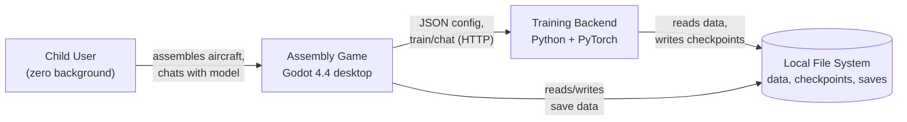
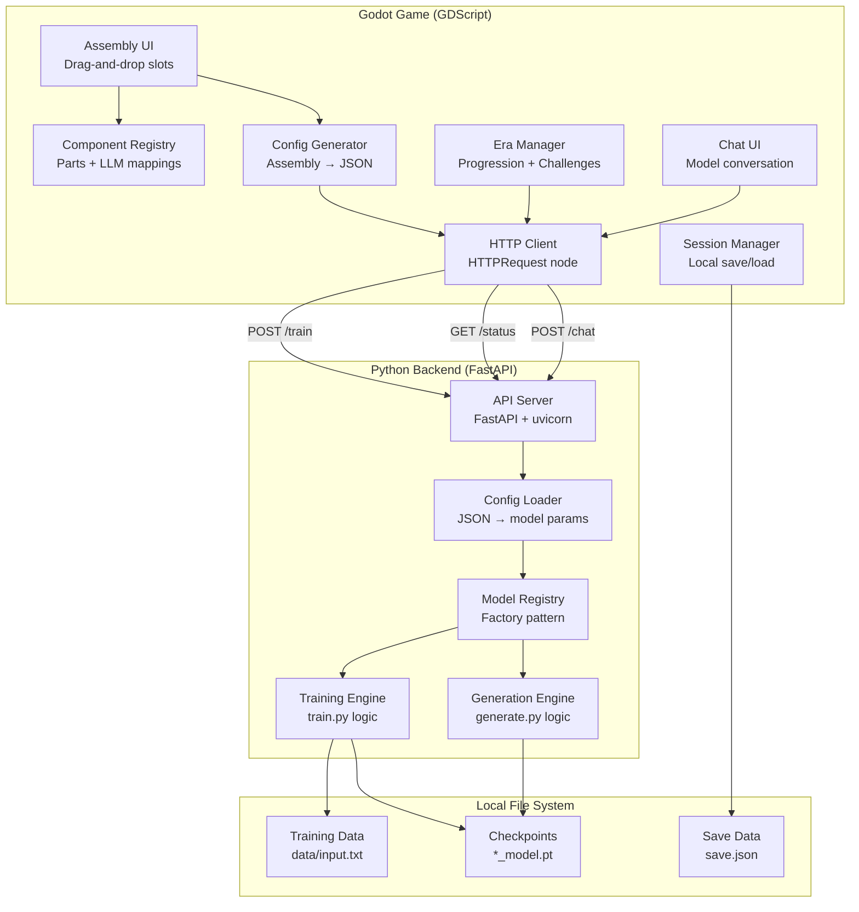
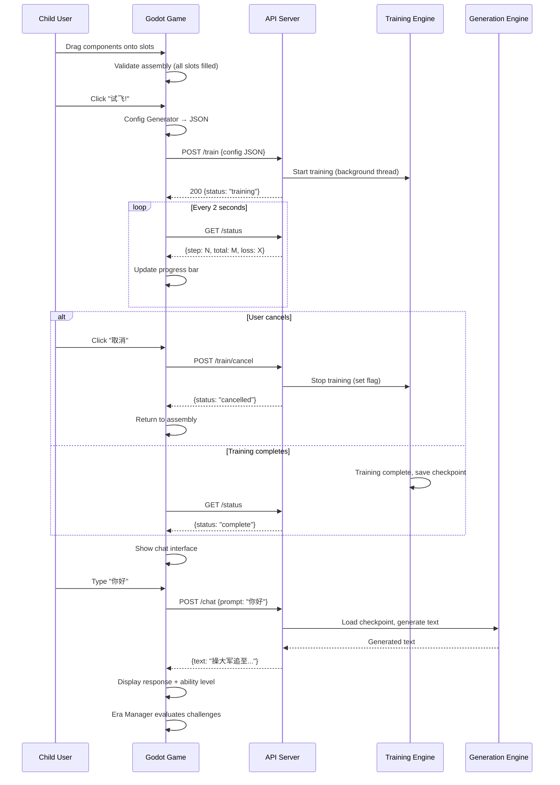

# Architecture: LLM Assembly Game

## System Context



The system consists of two processes running on the user's machine:

1. **Godot Game** — The user-facing desktop application. Handles all
   UI, drag-and-drop interaction, era progression, and challenge
   evaluation.
2. **Python Backend** — A local HTTP server wrapping the existing myllm
   training and generation code. Receives JSON configs, trains models,
   and serves generated text.

They communicate via localhost HTTP. No network access required.

## Components



### Godot Game Components

#### Assembly UI
- **Responsibility**: Render aircraft frame with slots, handle
  drag-and-drop of components, show visual feedback
- **Technology**: Godot Control nodes (_get_drag_data, _can_drop_data,
  _drop_data)
- **Exposes**: Completed assembly state to Config Generator
- **Consumes**: Component Registry for available parts per era

#### Component Registry
- **Responsibility**: Define all game components with their LLM
  mappings, ability stats, era availability, and slot compatibility
- **Technology**: GDScript resource files (dictionaries)
- **Exposes**: Component list filtered by era and slot type
- **Consumes**: Nothing (static data, loaded at startup)

#### Config Generator
- **Responsibility**: Convert a completed assembly into a JSON config
  matching myllm MODEL_CONFIGS format
- **Technology**: GDScript JSON class
- **Exposes**: JSON config string/file
- **Consumes**: Assembly state from UI, mapping rules from Registry

#### Era Manager
- **Responsibility**: Track era progression, manage challenge state,
  evaluate challenge completion, unlock next era
- **Technology**: GDScript with regex/string matching for challenge
  evaluation
- **Exposes**: Current era, available components, challenge status
- **Consumes**: Generated text (from Chat UI) for challenge evaluation

#### Chat UI
- **Responsibility**: Display chat interface, send user input to
  backend, show generated response with ability-level framing
- **Technology**: Godot RichTextLabel + LineEdit
- **Exposes**: Generated text to Era Manager (for challenge evaluation)
- **Consumes**: HTTP responses from backend /chat endpoint

#### Session Manager
- **Responsibility**: Save/load user progress (unlocked eras,
  completed challenges, last assembly state)
- **Technology**: GDScript FileAccess, JSON serialization
- **Exposes**: Restored state on game launch
- **Consumes**: Current game state on save triggers

#### HTTP Client
- **Responsibility**: Communicate with Python backend (train, status,
  chat)
- **Technology**: Godot HTTPRequest node + Timer for polling
- **Exposes**: Async responses to UI components
- **Consumes**: JSON payloads from Config Generator and Chat UI

### Python Backend Components

#### API Server
- **Responsibility**: Expose HTTP endpoints for training, status
  polling, and chat
- **Technology**: FastAPI + uvicorn
- **Exposes**: POST /train, GET /status, POST /chat, GET /health
- **Consumes**: JSON config from game, model checkpoints

#### Config Loader
- **Responsibility**: Parse incoming JSON config and map to myllm
  internal parameters (vocab_size, n_embd, n_head, n_layer, dropout,
  block_names, embedding_type, batch_size, block_size, max_steps, lr)
- **Technology**: Python json module
- **Exposes**: Validated config dict to Training Engine
- **Consumes**: Raw JSON from API Server

#### Training Engine
- **Responsibility**: Execute model training using existing myllm
  logic. Report progress (step, loss) to API Server. Save checkpoint.
- **Technology**: PyTorch, existing train.py logic refactored into
  callable functions
- **Exposes**: Training progress (step/total, loss), completion status
- **Consumes**: Config from Config Loader, training data from file
  system

#### Generation Engine
- **Responsibility**: Load trained model checkpoint, generate text
  from a prompt
- **Technology**: PyTorch, existing generate.py logic refactored into
  callable functions
- **Exposes**: Generated text string
- **Consumes**: User prompt, model checkpoint

#### Model Registry
- **Responsibility**: Factory pattern for creating models, embeddings,
  blocks from config parameters
- **Technology**: Existing MODEL_REGISTRY, build_op(), build_blocks(),
  build_embedding()
- **Exposes**: Constructed model instances
- **Consumes**: Config parameters

## Data Flow

### Primary Flow: Assemble → Train → Chat



### Config JSON Schema

The game exports JSON matching the existing MODEL_CONFIGS structure:

```json
{
  "model_type": "assembled",
  "batch_size": 32,
  "block_size": 256,
  "max_steps": 1000,
  "lr": 1e-3,
  "n_embd": 64,
  "n_head": 4,
  "n_layer": 1,
  "dropout": 0.0,
  "embedding_type": "token_position",
  "block_names": ["attention", "ffn"]
}
```

Era determines which fields are present:

| Era | model_type | Key config fields |
|-----|-----------|-------------------|
| 1 WWI | bigram | batch_size, block_size, max_steps, lr |
| 2 WWII | assembled | + n_embd, embedding_type=token_position, block_names=[attention] |
| 3 Jet | assembled | + n_head, block_names=[attention, ffn] |
| 4 Modern | assembled | + n_layer > 1 |
| 5 Stealth | assembled | + dropout > 0, tokenizer_type=bpe (future) |

## Integration Boundaries

| System | Protocol | Format | Failure Mode | Auth |
|--------|----------|--------|-------------|------|
| Python Backend | HTTP localhost:8741 | JSON | Game shows "引擎启动失败" error, retry button | None (localhost only) |
| File System (training data) | File I/O | UTF-8 text | Game shows "训练数据未找到" with download button | N/A |

**Training data distribution**: data/input.txt (三国演义, ~1.8MB) is
bundled in the Python backend directory. If missing, the game's first-run
check offers a one-click download from the public corpus URL.
| File System (checkpoints) | File I/O | PyTorch .pt | Training re-runs if checkpoint missing | N/A |
| File System (save data) | File I/O | JSON | Graceful reset to initial state | N/A |

### Python Backend API

```
POST /train
  Body: {config JSON}
  Response: {status: "training", session_id: "xxx"}

GET /status
  Response: {status: "training"|"complete"|"error"|"cancelled",
             step: int, total: int, loss: float,
             error_message?: string}

POST /train/cancel
  Response: {status: "cancelled"}
  Note: Stops current training, discards incomplete checkpoint.

POST /chat
  Body: {prompt: string, max_tokens?: int}
  Response: {text: string}

GET /health
  Response: {status: "ok", device: "cpu"|"cuda"}
```

## Requirement Traceability

| REQ-ID | Requirement | Component(s) |
|--------|-------------|---------------|
| REQ-001 | Drag-and-drop assembly | Assembly UI, Component Registry |
| REQ-002 | Era progression system | Era Manager, Component Registry |
| REQ-003 | Dual-label component mapping | Component Registry |
| REQ-004 | Config export from assembly | Config Generator, Config Loader |
| REQ-005 | Training with progress feedback | HTTP Client, API Server, Training Engine |
| REQ-006 | Chat with trained model | Chat UI, HTTP Client, API Server, Generation Engine |
| REQ-007 | Task challenge system | Era Manager (challenge evaluation) |
| REQ-008 | Aircraft theme skin | Assembly UI, Component Registry (theme-separated) |
| REQ-009 | Session persistence | Session Manager |
| REQ-010 | Chinese-first UI | All Godot UI components (text in Chinese) |

## Cross-Cutting Concerns

### Error Handling

- **Training errors** (NaN loss, CUDA OOM): Backend catches and
  returns error status. Game displays child-friendly message:
  "飞机试飞出了点问题，换个组合试试？"
- **Backend not running**: Game checks /health on startup. If
  unreachable, shows "请先启动训练引擎" with instructions.
- **Invalid config**: Config Loader validates before training. Returns
  specific error ("缺少引擎组件" = missing block_names).

### Session & State Management

- Game state saved as JSON to user data directory
  (Godot `user://save.json`)
- Save triggers: era completion, challenge completion, game close
- Load on startup with schema validation; corrupt data → clean reset
- No autosave during assembly (only on explicit actions)

### Logging & Observability

- Python backend: stdout logging with step/loss/time for debugging
- Godot: print_debug for development, no user-visible logs
- Training metrics (loss curve) stored in status response for
  potential future visualization

## Technology Map

| Component | Technology | Version | Rationale |
|-----------|-----------|---------|-----------|
| Game engine | Godot | 4.4 stable | Free, open-source, lightweight, native drag-and-drop |
| Game language | GDScript | 2.0 | Python-like syntax, low barrier, built-in |
| Backend framework | FastAPI | 0.100+ | Async, lightweight, auto-docs, easy to wrap existing code |
| ML framework | PyTorch | 2.0+ | Already used by myllm codebase |
| Backend runner | uvicorn | 0.20+ | Standard ASGI server for FastAPI |
| Config format | JSON | N/A | Native on both Godot and Python |
| Save format | JSON | N/A | Simple, human-readable, GDScript native support |
| Python packaging | PyInstaller | 6.0+ | Bundle training backend for distribution (future) |

## Architectural Decisions

### ADR-1: Two-Process Architecture (Game + Backend)

**Status**: Accepted
**Context**: The game (Godot/GDScript) needs to run Python+PyTorch
training. Options: embed Python in Godot, single process, or
separate processes.
**Decision**: Two separate processes communicating via localhost HTTP.
**Rationale**: Clean separation of concerns. Godot doesn't need to
know about PyTorch. Python backend can be developed and tested
independently. HTTP is debuggable and language-agnostic.
**Alternatives considered**:
- Embed Python via GDExtension: Complex build, fragile, version
  conflicts
- OS.execute() per command: Blocking, no streaming progress, no
  session reuse
**Consequences**: User must start both processes. Adds ~3s startup
latency for FastAPI+PyTorch import.
**Addresses**: REQ-004, REQ-005, REQ-006

### ADR-2: Polling for Training Progress (not WebSocket)

**Status**: Accepted
**Context**: Game needs real-time training progress updates.
**Decision**: Godot Timer polls GET /status every 2 seconds.
**Rationale**: Simpler than WebSocket. 2-second interval is fine for
a progress bar (30 updates for a 60-second training). Godot
HTTPRequest node handles it natively.
**Alternatives considered**:
- WebSocket: More complex setup in both Godot and FastAPI, marginal
  benefit for this use case
- Server-Sent Events: Limited Godot support
**Consequences**: 2-second latency on progress display. Acceptable
for children's game UX.
**Addresses**: REQ-005

### ADR-3: Static Component Registry (not database)

**Status**: Accepted
**Context**: Game components (parts, mappings, stats) need to be
stored somewhere.
**Decision**: GDScript resource files (dictionaries/arrays) loaded
at startup. No database.
**Rationale**: Component data is static and small (~50 entries across
5 eras). A database adds unnecessary complexity for read-only data.
Aligns with P7 (YAGNI).
**Alternatives considered**:
- SQLite: Overkill for static data
- JSON data files: Possible, but GDScript resources are more
  idiomatic and type-safe
**Consequences**: Adding new components requires code change (not
data-only change). Acceptable for v1.
**Addresses**: REQ-002, REQ-003

### ADR-4: Refactor train.py into Callable Functions

**Status**: Accepted
**Context**: Current train.py is a top-level script with global
variables. Backend API needs to call training as a function.
**Decision**: Extract training logic into a `train_model(config)`
function that returns progress callbacks. Keep train.py as CLI
entry point calling this function.
**Rationale**: Minimal refactor. Preserves existing CLI usage while
enabling API integration. Does not change model.py at all.
**Alternatives considered**:
- Subprocess train.py with --config flag: Loses progress streaming
- Complete rewrite: Unnecessary, existing logic is correct
**Consequences**: train.py gains ~20 lines of function wrapping.
**Addresses**: REQ-004, REQ-005

## Constraints & Trade-offs

### Hard Constraints (from Constitution)
- P1 Education First: Architecture simplicity over elegance
- P4 Honest Metaphors: Component Registry must maintain accurate
  LLM mappings
- P6 Chinese-First: All user-facing strings in Chinese
- P7 YAGNI: No speculative infrastructure
- P8 Single Skin First: Only aircraft theme in v1
- P9 Sub-60s Training: Config Loader must enforce parameter limits

### Trade-offs Accepted
- **Two-process startup complexity** vs clean separation of concerns
  → Accepted: can mitigate with a launcher script
- **2s polling latency** vs WebSocket complexity → Accepted: children
  won't notice 2s progress bar granularity
- **PyTorch import time (~3s)** vs user experience → Accepted:
  launch backend at game startup, hide behind loading screen
- **800MB Python bundle size** vs zero-install experience → Deferred:
  v1 requires pre-installed Python, bundling is future work

### Known Limitations
- No GPU support in v1 (CPU-only training)
- BPE tokenizer not yet implemented (Era 5 incomplete until myllm
  roadmap step 5)
- Single concurrent training session (no parallel model training)
- No model caching (re-trains from scratch each time)
- MODEL_REGISTRY has no "assembled" key — game configs use
  AssembledModel via specific names (attention_ffn, multihead, etc.).
  Need to either add a generic "assembled" registry entry or have the
  Config Loader map era configs to existing model type names.
- Era 2 (single-head self-attention) has no direct assembled config
  in the codebase. Current "attention" type uses SelfAttentionLanguageModel
  (non-assembled). Will need either n_head=1 with AssembledModel or a
  new factory path.
